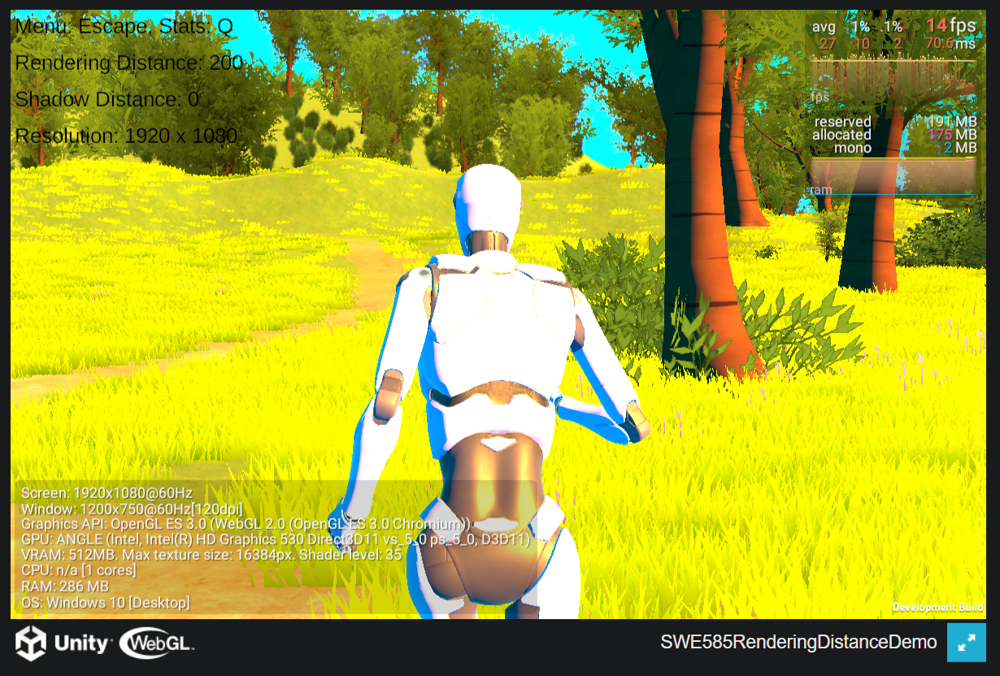
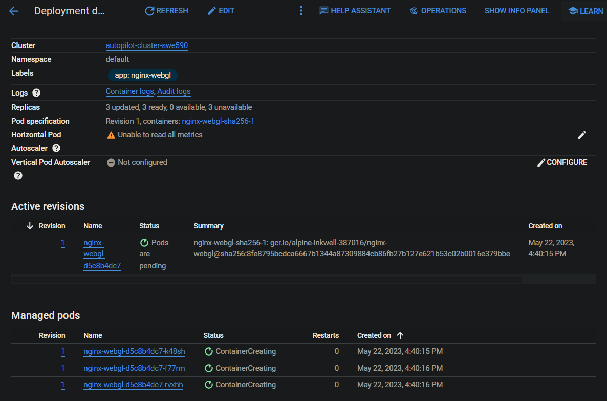
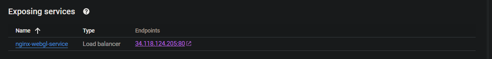
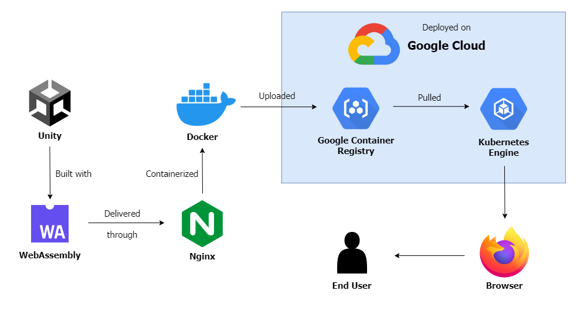
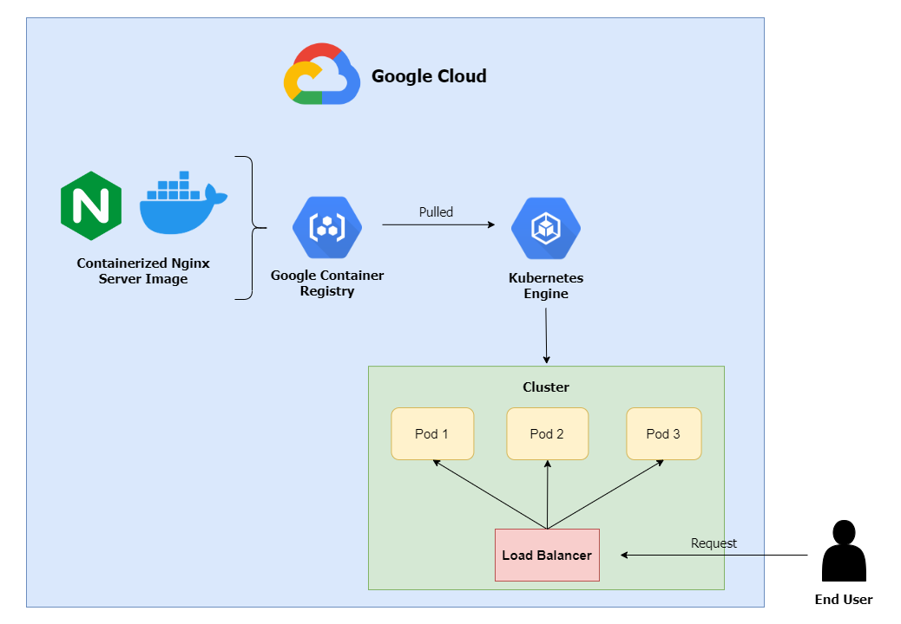

# SWE590Cloud
Cloud computing application project for SWE590. This repository contains a WebAssembly build of the project.

# Deployment
The application is dockerized and deployed online on Goodgle Cloud with the Kubernetes Engine, using ngnix:
[http://34.118.124.205/](http://34.118.90.143/) as of 22 May 2023. Note that the project will be taken offline at a later date.

Following is a screenshot of the game played on a browser: 
  
Following are screenshots of cluster information from the Google Cloud console: 

  
Following is a diagram of the workflow and content delivery: 
  
Following is a diagram of the architecture: 
  

# Report and Presentation
The project report is available in the repository, and a video demonstration is available on YouTube.

# Notice
Unity game repository available at [SWE585TechDemo](https://github.com/dbaslan/SWE585TechDemo), along with notice for 3rd party assets.
